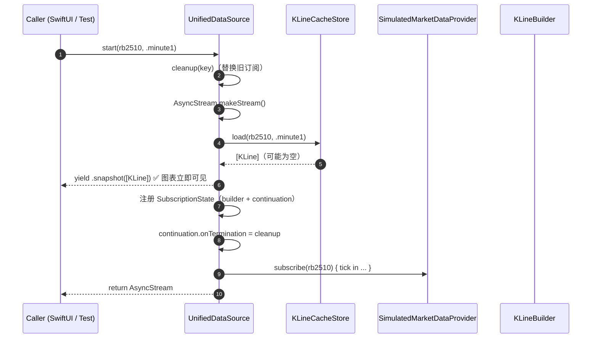
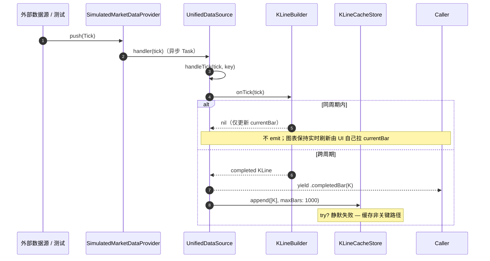
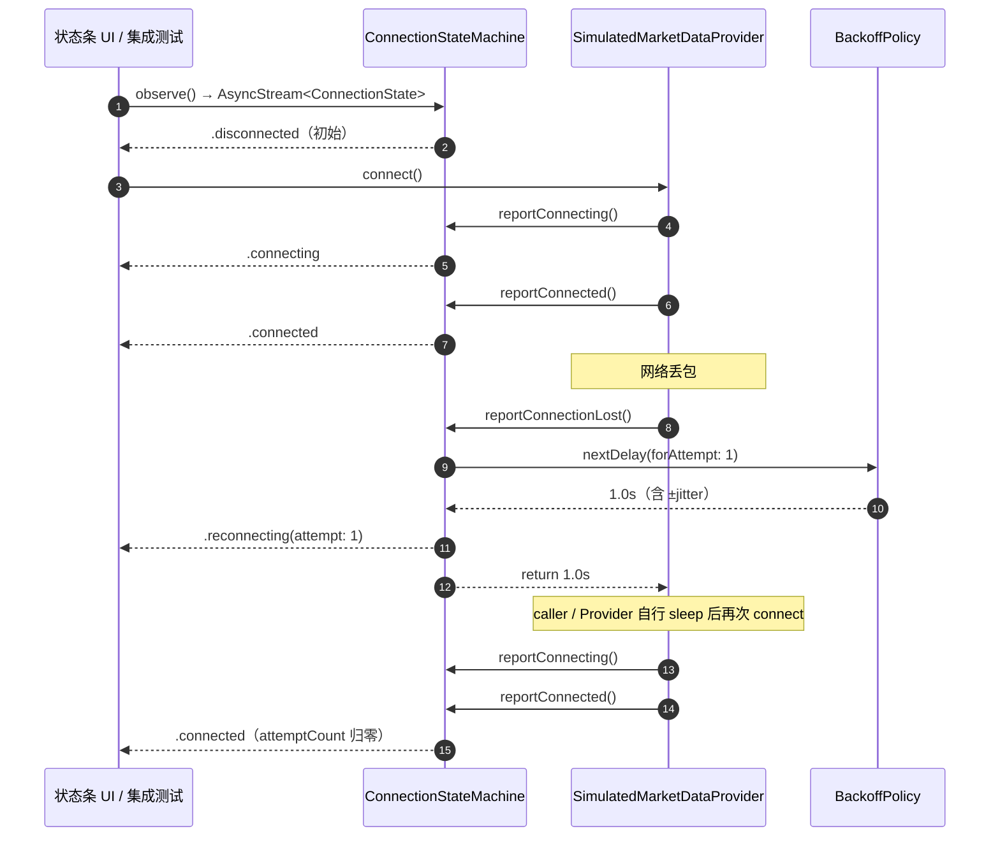
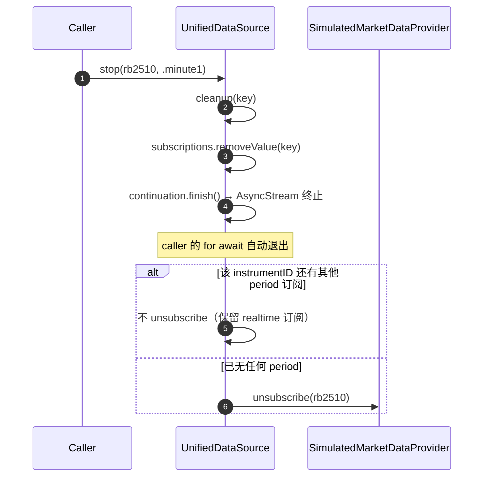

## WP-21a 数据管线 · Linux 全验子集

> 本文档是 WP-21a 的核心交付物（ChatGPT A02 必产之一）。描述 Stage A 行情数据管线的 Linux 全验阶段实现 + WP-21b Mac 真 CTP 接入指引。
>
> **版本**：v1.0 · 2026-04-25
> **对应 WP**：WP-21（Stage A 工作包清单）· ChatGPT A02
> **前置 WP**：WP-24（8 Core 骨架）· WP-30/31（Legacy 迁移 + 协议抽象）

---

## 1. 设计目标（承自 D1 / Karpathy / ChatGPT A02）

- **启动不闪烁**：本地缓存优先恢复，UI 立即可见图表
- **实时与缓存切换平滑**：UnifiedDataSource Facade 统一入口，caller 不感知数据来源
- **多合约严格隔离**：rb 推 rb / hc 推 hc 永不串线
- **断线重连自管**：状态机可观察，UI 显示状态灯
- **Linux 可全验**：CTP SDK 接入留给 Mac，Linux 端完整跑通契约 + 状态机 + 持久化

---

## 2. 整体架构（Linux 全验子集）

```
┌─────────────────────────────────────────────────────────────────────┐
│  Caller（SwiftUI demo / 集成测试 / 上层业务）                       │
│                                                                     │
│  for await update in source.start(rb2510, .minute1) {               │
│      // .snapshot([KLine]) → 图表立即显示                           │
│      // .completedBar(K)   → 图表增量更新                           │
│  }                                                                  │
└──────────────────────────┬──────────────────────────────────────────┘
                           │
                  ┌────────▼────────────┐
                  │ UnifiedDataSource   │ actor · DataSource/
                  │ （子模块 4）        │
                  └─┬──────────┬────────┘
                    │          │
        ┌───────────▼─┐    ┌──▼─────────────────────────┐
        │ KLineCache  │    │ SimulatedMarketDataProvider│ actor
        │ Store       │    │ （子模块 2）               │
        │ （子模块 3）│    │                            │
        │             │    │ ┌────────────────────────┐ │
        │ • InMemory  │    │ │ ConnectionStateMachine │ │ actor
        │ • JSONFile  │    │ │ （子模块 1）           │ │
        └─────────────┘    │ │  + BackoffPolicy       │ │
                           │ │  + AsyncStream<State>  │ │
                           │ └────────────────────────┘ │
                           └────────────┬───────────────┘
                                        │
                              ┌─────────▼──────────┐
                              │ KLineBuilder        │ class
                              │ （已存在 · 不重建）│
                              └─────────────────────┘

辅助：TradingCalendar（子模块 5）· 给 Tick/K 线打 tradingDay 标签
      ContractManager · ProductSpecLoader · ContractStore（前置 WP-30）
```

---

## 3. 时序图

### 3.1 启动恢复（caller 调 start）



### 3.2 实时 Tick → completedBar



### 3.3 断线重连（ConnectionStateMachine 协作）



**关键设计**：CSM 不持有 Task / 不主动 sleep —— 时间外置给 caller。这让单元测试 100% 确定性，无需 Task.sleep 等待。

### 3.4 stop / stopAll 清理



---

## 4. 各组件职责对照表

| 子模块 | 文件 | 类型 | 职责 | WP-21b 替换计划 |
|--------|------|------|------|----------------|
| 1 | `Connection/BackoffPolicy.swift` | protocol + struct | 退避秒数计算（ExponentialBackoff / NoBackoff）| 不替换 |
| 1 | `Connection/ConnectionStateMachine.swift` | actor | 状态转移 + AsyncStream 推送 | 不替换 |
| 2 | `Simulated/SimulatedMarketDataProvider.swift` | actor | 实现 MarketDataProvider · 集成 CSM · 故障注入 | **替换为 CTPMarketDataProvider** |
| 3 | `Cache/KLineCacheStore.swift` | protocol + InMemory | 协议 + 内存实现 | 不替换 / 后续 SQLite 由 WP-19 加 |
| 3 | `Cache/JSONFileKLineCacheStore.swift` | actor | JSON 文件持久化 | 不替换 |
| 4 | `DataSource/UnifiedDataSource.swift` | actor | 总入口 Facade · 工作流编排 | **接口签名不变；构造时注入 CTPMarketDataProvider 即可** |
| 5 | `ContractManager/TradingCalendar.swift` | struct | 交易时段 + 夜盘归属 + 周末跳过 | 不替换 / 节假日表 v2 |
| 既有 | `MarketData/KLineEngine/KLineBuilder.swift` | class | Tick → KLine 合成 | 不替换 |
| 协议 | `Protocols/MarketDataProvider.swift` | protocol | 实时行情统一契约 | 不替换 |
| 协议 | `Protocols/HistoricalKLineProvider.swift` | protocol | 历史 K 线统一契约 | v2 接入 UnifiedDataSource |

---

## 5. WP-21b Mac 切机指引

### 5.1 必做

**实现 `CTPMarketDataProvider`**（`Sources/DataCore/MarketData/CTP/CTPMarketDataProvider.swift`）：
- 实现 `MarketDataProvider` 协议（与 SimulatedMarketDataProvider 同接口）
- 内部桥接 CTP `thostmduserapi_se` C++ SDK
- D2 §4 技术栈选定：**Obj-C++ 桥接层**（`.mm` 文件 + `module.modulemap`）
- 桥接路径：`Sources/CTPBridge/` → 暴露 C-style API → Swift FFI 调用
- 行为契约：
  - `connect()` 异步握手（CTP 登录 + 鉴权）
  - `subscribe(instrumentID:)` → CTP `SubscribeMarketData`
  - `OnRtnDepthMarketData` C++ 回调 → 桥接到 Swift handler
  - 集成 `ConnectionStateMachine`（断线时 `reportConnectionLost()`）

### 5.2 接口契约位置

| 契约 | 文件 |
|------|------|
| MarketDataProvider 协议 | `Sources/DataCore/Protocols/MarketDataProvider.swift` |
| ConnectionState enum | 同上 |
| Tick 数据模型 | `Sources/Shared/Models/Tick.swift` |
| BackoffPolicy 注入点 | `ConnectionStateMachine.init` |

### 5.3 替换流程

1. Mac 切机 → 申请 SimNow 账号 + 下载 CTP API Linux/Mac 版（CTP API 跨 Linux/Mac，但 Linux Swift-C++ interop 不稳，故 Mac 优先）
2. 写 `CTPMarketDataProvider`（Linux 上可写但用 Mac 跑测试）
3. 调用方升级：`UnifiedDataSource(cache:, realtime: ctpProvider)` —— 接口零变更
4. SwiftUI demo 接入 `UnifiedDataSource` → 真实行情图表

### 5.4 真接入后的额外验收（ChatGPT A02 DoD）

- [ ] SimNow 订阅成功 + Tick 落到 SwiftUI demo
- [ ] 夜盘日盘分界正确（用 `TradingCalendar.expectedTradingDay` 验证）
- [ ] 实时数据与本地缓存切换不闪烁（启动 → snapshot → 实时增量 平滑过渡）
- [ ] 断线后自动重连 + UI 状态条显示 `.reconnecting(attempt: N)`
- [ ] 多合约同时订阅数据不串线（已在子模块 2 测试覆盖，真 CTP 上回归一次）

---

## 6. 关键设计取舍记录

| 决策 | 选择 | 理由 |
|------|------|------|
| 状态机 | actor + AsyncStream，**不持有 Task** | 时间外置 → 测试 100% 确定性；caller 决定 sleep 时机 |
| 缓存层 | 协议 + 多实现（InMemory + JSONFile）| 测试无需文件 IO；production 走文件；SQLite 留 WP-19 |
| Cache 序列化 | JSON + iso8601 + sortedKeys | 跨平台 + diff 友好 + 缓存命中可观察；Decimal 精度对 K 线（≤4 位小数）足够 |
| 历史数据合并 | v1 不做（只 cache + realtime）| HistoricalKLine ↔ KLine 类型适配复杂，留 v2 |
| Tick 级 emit | 不 emit | 上层若需要走 MarketDataProvider 直接订阅；UnifiedDataSource 只吐完成 K 线 |
| 当前未完成 K 线 | 不 emit（KLineBuilder 只在跨周期返回完成 K 线）| 简化 v1；UI 实时刷新由 caller 自己 Tick 订阅 + KLineBuilder.currentKLine |
| 节假日 | v1 仅跳周末 | 节假日表 v2 接 JSON（每年更新）；CTP 实际 tradingDay 字段已含节假日 |
| 模拟 provider 命名 | `Simulated` 而非 `CTPSimNow` | 不实际调 CTP，避免误导 |

---

## 7. 测试覆盖

WP-21a 共 92 测试 / 20 suites（Linux swift test 全绿 < 0.2s）：

| 子模块 | 套件数 | 测试数 |
|--------|--------|--------|
| 1 BackoffPolicy + ConnectionStateMachine | 4 | 12 |
| 2 SimulatedMarketDataProvider | 4 | 16 |
| 3 KLineCacheStore (InMemory + JSONFile + merged) | 3 | 19 |
| 5 TradingCalendar 边界 | 5 | 36 |
| 4 UnifiedDataSource Facade | 4 | 9 |

**测试关键约束**：
- 无 `Task.sleep`（除 collector helper 5ms 等待）→ 整套 < 200ms
- 无网络依赖
- 无文件 IO（除 JSONFile 测试用临时目录）
- 无 KLineBuilder 真 fixture 数据（用最小 Tick 触发跨周期即可）

---

## 8. 修订日志

| 日期 | 版本 | 修订 |
|------|------|-----|
| 2026-04-25 | v1.0 | 初稿 · WP-21a 子模块 6 收尾 · 6 子模块全交付 + Mac 切机指引 |
